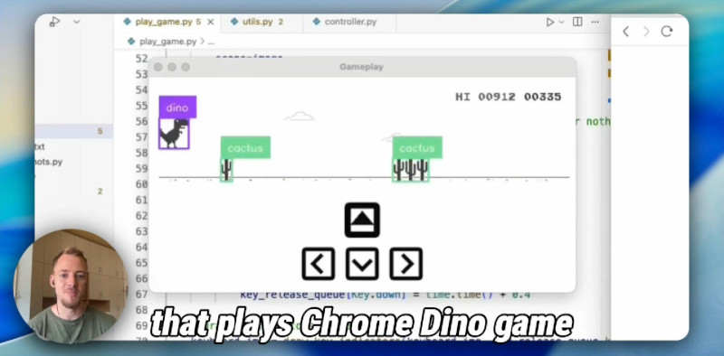

# Chrome Dino Game bot using YoloV8

Video demo:
[](https://www.youtube.com/watch?v=f05Hnh9Rd_U)

## Setup

```bash
pip install -r requirements.txt
```

If you have a CUDA GPU, you should install the `inference-gpu` package instead of `inference`.

## Run

```
python3 play_game.py
```

This will:
1. Ask user to select the monitor and ROI of the game
2. Download the [Yolov8 AI model](https://universe.roboflow.com/erol4/dino-game-rcopt) locally
3. Continuously capture the screenshot of the game and run inference on it
4. Based on detection results, it will press the up/down arrow keys to jump/duck over the obstacles

## Dataset

```
python3 take_screenshots.py
```

This will continuously capture the screenshot of the game and save it to the `dataset` folder.